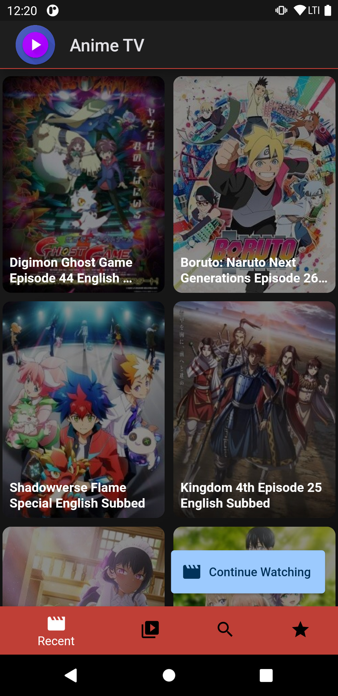
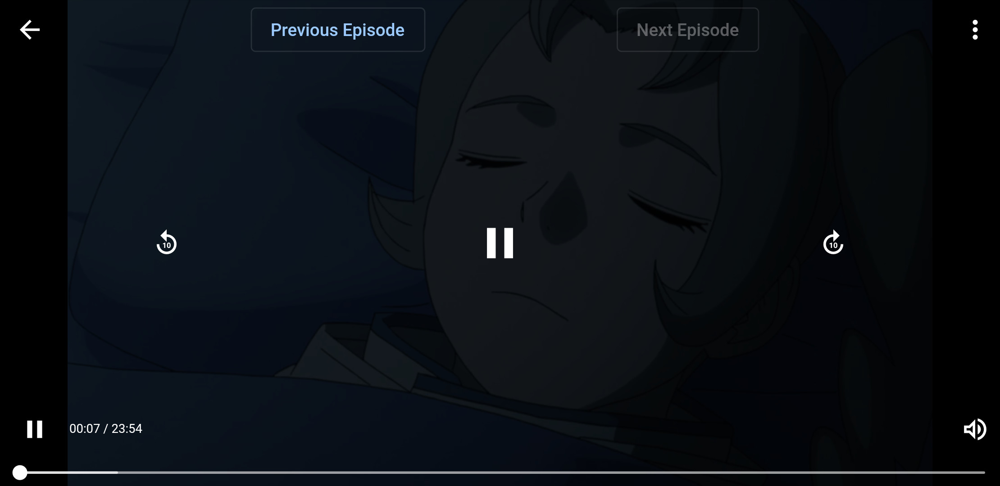
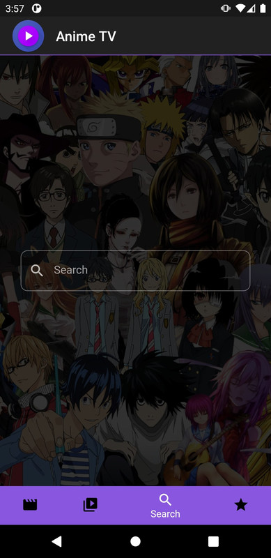
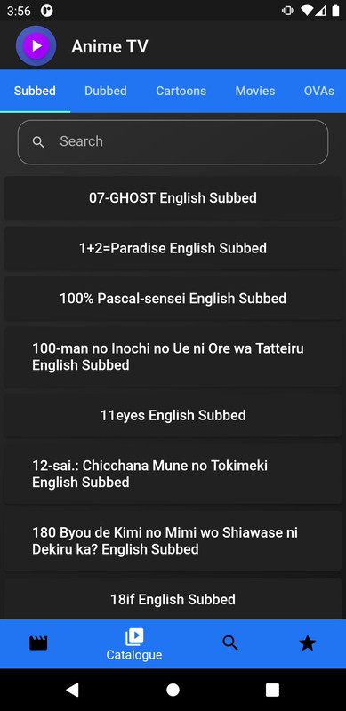

<p align="center">
    

<h1 align="center">Anime TV!</h1>
    
<h3 align="center"> Watch your favorite anime on your device </h3>

Anime TV! is a cross-platform app that allows you to watch your favorite anime shows on your device. Supports Android and iOS supported by flutter. Officially tested on Android.

It has a low memory footprint, stores all information on your device and works off the ~~[Anime1](http://www.anime1.com/)~~ [Wcostream](https://www.wcostream.net/) server. The app scrapes the site and provides a pleasant
anime viewing experience. Unlike other apps, this does not contain any ads and is distributed for free.
Currently, this app is not available in the App Store but you can view the releases page to download the apk file and install on your device.

</img> </img>

</img>

 
 

 ***
## Setting up

Make sure you have flutter installed on your device, along with the necessary SDKs for your platform.

If you decide to change the app name, icon, or both, make sure to run the following commands.

```sh
flutter pub run flutter_app_name
flutter pub run flutter_launcher_icons:main
flutter pub run flutter_native_splash:create
```

## Build the apk

```sh

flutter build
```

## Running Tests

```sh
flutter test
```

Currently, only the scraper has unit tests. If you would like to write the tests, start an issue. Please make sure the tests are meaningful! I do not want to over-engineer a volatile app (I obviously don't own the server).

## Contributing

A few resources to get you started if this is your first Flutter project:

- [Lab: Write your first Flutter app](https://flutter.dev/docs/get-started/codelab)
- [Cookbook: Useful Flutter samples](https://flutter.dev/docs/cookbook)

For help getting started with Flutter, view the
[online documentation](https://flutter.dev/docs), which offers tutorials,
samples, guidance on mobile development, and a full API reference.

1. Fork it (<https://github.com/GnikDroy/AnimeTV/fork>)
2. Create your feature branch (`git checkout -b feature/fooBar`)
3. Commit your changes (`git commit -am 'Add some fooBar'`)
4. Push to the branch (`git push origin feature/fooBar`)
5. Create a new Pull Request

Gnik - gnikdroy@gmail.com

Distributed under a MIT license. See ``LICENSE`` for more information. Please use this app responsibly. There is no planned release simply due to the nature of the application.
